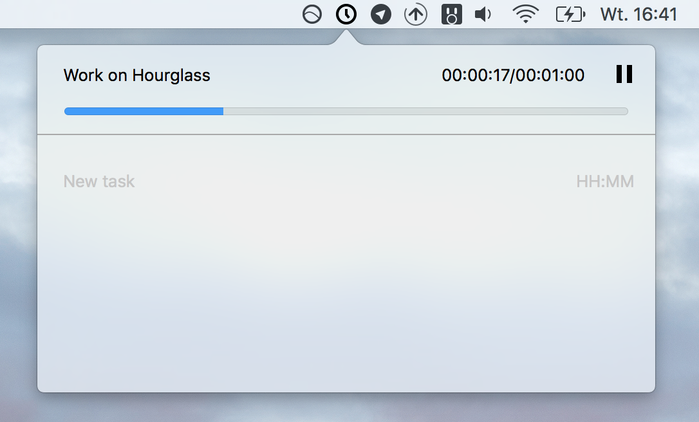

# Hourglass app

A simple app for time management.

## My productivity system

Every morning, I add all long running tasks to the app. Every task has associated duration which is a daily goal of time spent doing an activity. During the day I use timers to measure time spent on tasks. At the end of the day I can verify my assumptions.

The goal is to learn about my time spending habits and ideally be more productive doing things I actually plan to do.

## License
MIT. You can find it in the `LICENSE` file.
Please note that this is not a product and therefore I am not expecting to spend a lot of time developing it further.
